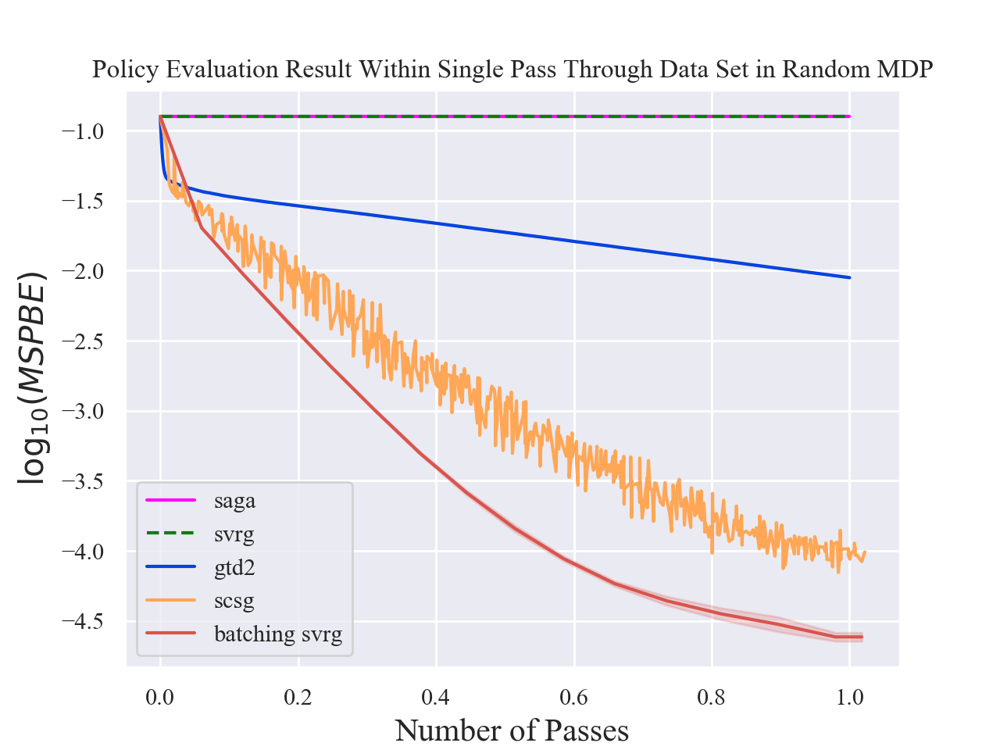

# SVRG for Policy Evaluation with Fewer Gradient Evaluations

## Abstract
Stochastic variance-reduced gradient (SVRG) is an optimization method originally designed for tackling machine learning problems with a finite sum structure. SVRG was later shown to work for policy evaluation, a problem in reinforcement learning in which one aims to estimate the value function of a given policy. SVRG makes use of gradient estimates at two scales. At the slower scale, SVRG computes a full gradient over the whole dataset, which could lead to prohibitive computation costs. In this work, we show that two variants of SVRG for policy evaluation could significantly diminish the number of gradient calculations while preserving a linear convergence speed. More importantly, our theoretical result implies that one does not need to use the entire dataset in every epoch of SVRG when it is applied to policy evaluation with linear function approximation. Our experiments demonstrate large computational savings provided by the proposed methods.

## Selected experiment results

  

Batching SVRG and SCSG are our proposed method. The above result shows that our proposed methods perform policy evaluation effectively within a single pass through the dataset.

## Links to our paper and my thesis:
<a href="https://arxiv.org/abs/1906.03704">Arxiv paper</a>

<a href="https://github.com/zilunpeng/svrg_for_policy_evaluation_with_fewer_gradients/blob/master/msc_thesis.pdf">My Msc thesis</a>
